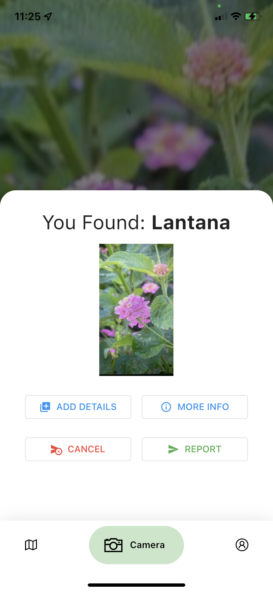
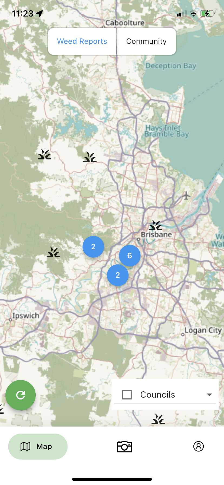
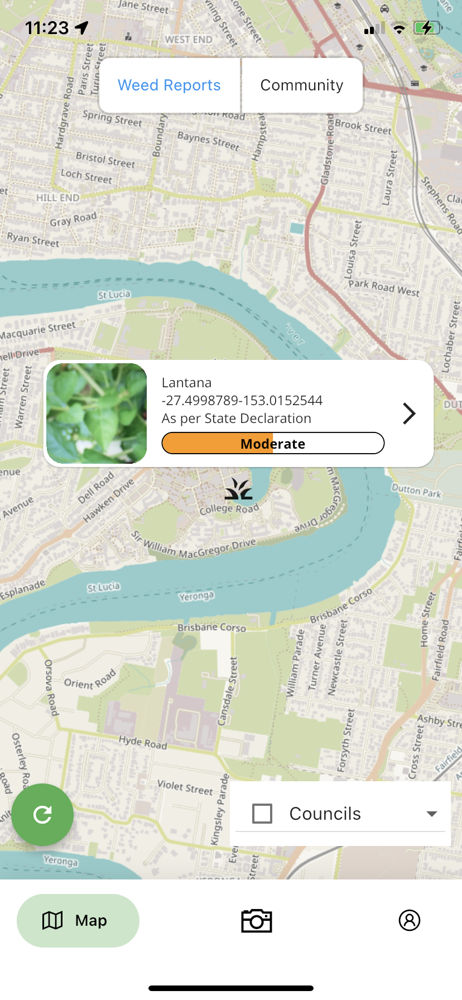
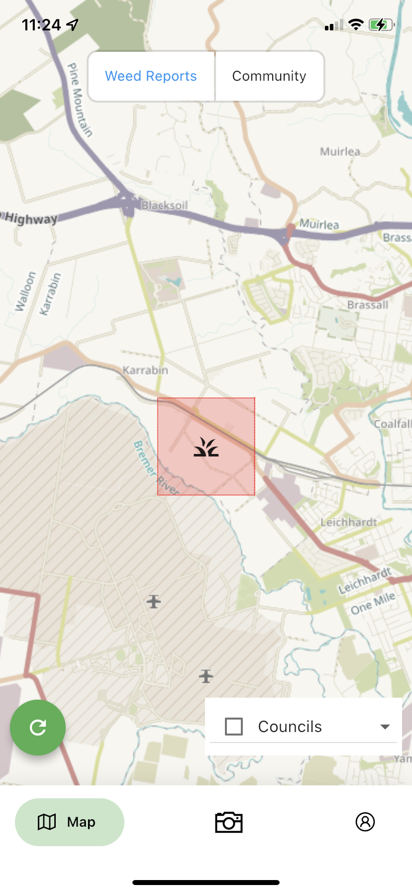
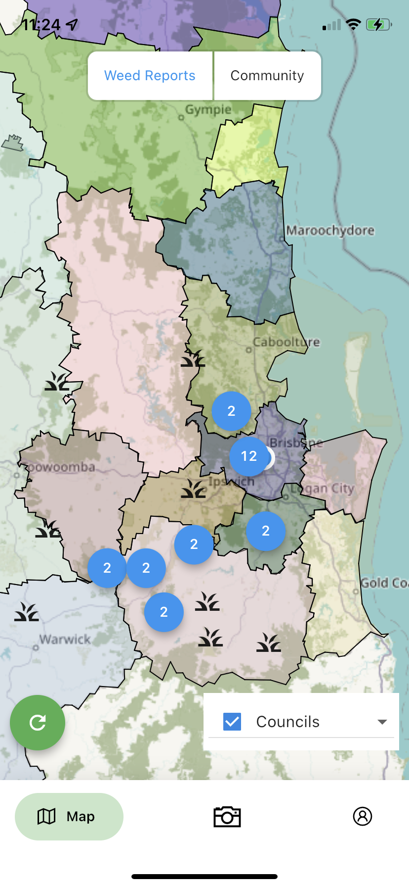
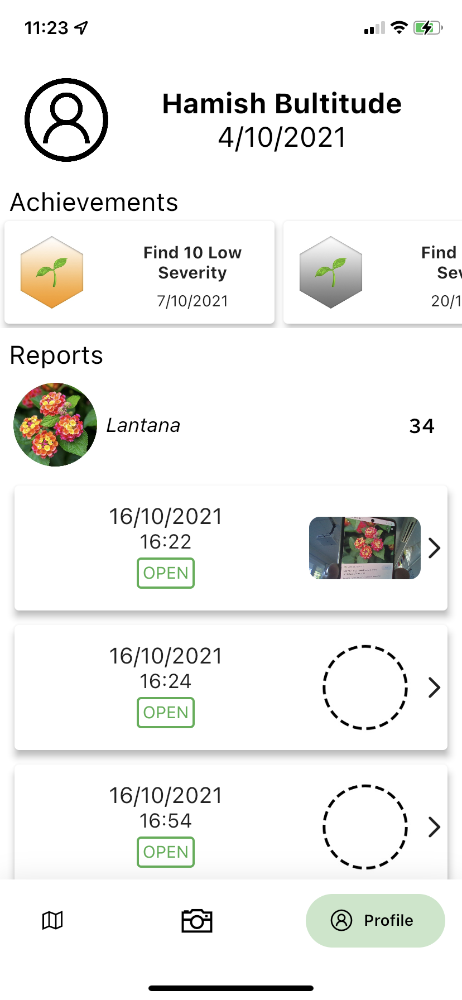
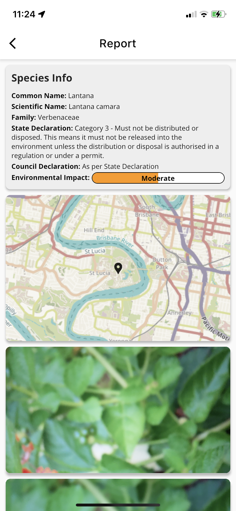

  

> A holistic solution to the identification and removal of invasive species by 
> both the community and the council.

# Stack 
## Frontend
 
See the `invasiveFE` submodule:

`Flutter` - Google's Crossplatform UI toolkit for native development

`Tensorflow Lite` - Machine learning library

`geojson` - Represent geographical regions in `json`

`camera` - Camera & Image Stream support in flutter

## Backend

See the `invasiveBE` submodule:

`Python` - Interpreted, OOT, High level programming language

`FastAPI` - Web framework for RESTful APIs in Python

`Pydantic` - Creation of custom datatypes and models for use in RESTful APIs

`uvicorn` - ASGI Server implementation

`fuzzywuzzy` - Fuzzy search algorithm

`requests` - HTTP Request library

## Setup 

1. Clone this repo with `git clone --recurse-submodules https://github.com/MoreMilkPerMilk/uproot.git` to get all the code for the project
2. Install frontend requirements with `cd invasiveFE`, then `flutter pub get` in `invasiveFE`
3. Run `flutter doctor` to check your install status & devices connected to your computer (can be iOS, Android, Web)
4. Install & run a release / debug build of the Flutter app the device of your choice with `flutter run -d <device-name`. Check Flutter docs for more info.
4. Install backend requirements with `cd invasiveBE`, then `pip install -r requirements.txt` in `invasiveBE`
5. Run the backend with `./start.sh`

## Credits
### Programming
* [@hami-sh](https://github.com/hami-sh) | Hamish Bultitude 
* [@j-tobler](https://github.com/j-tobler) | James Tobler
* [@djamahl99](https://github.com/djamahl99) | Djamahl Etchegaray
* [@JoeHolownia](https://github.com/JoeHolownia) | Joe Holownia

### Design
* [@flambosa44](https://github.com/flambosa44) | Carl Shield
* Robert Hardgrove

# Images
## Camera

  
  
   

## Map

  
  
   
  
  

## User and Report Pages

  
  
   

